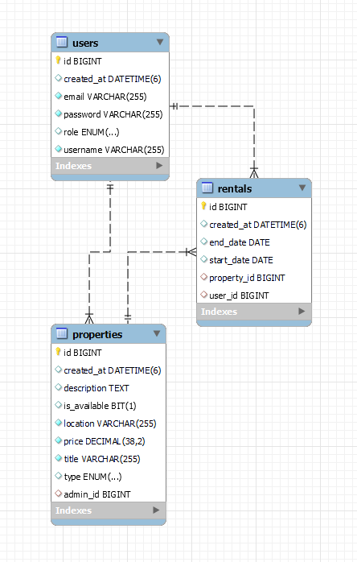

# Rent a House or Apartment

This website provides users with the opportunity to rent or purchase a house or an apartment. Each user can create a unique account, which allows them to access and utilize all the functionalities offered by the site.

## Features

### For Users

- **Login/Create an Account:** Users can log in to their account or create a new one.
- **Renting:** Users have the option to rent an apartment or a house for a specified period.

### For Admins

- **Get Reports:** Admins can obtain reports on apartments and houses that are currently rented.
- **Add Listings:** Admins have the ability to add new houses or apartments to the list of available rentals.

## Tech Stack

- **Backend:** Spring Boot
- **Database:** MySQL

  

Spring Boot is utilized for creating the backend services, providing an efficient and powerful way to build the application's API. MySQL is used as the database solution, offering reliable data storage and retrieval for both user and property information.

## API Endpoints

The website offers a comprehensive set of API endpoints to manage users, properties, and rentals, supporting various operations such as insertion, deletion, updating, and retrieval of information. These endpoints ensure seamless interaction between the frontend and the backend services.

### User Endpoints

- **POST /user/insert**: Allows for the creation of a new user account.
- **DELETE /user/delete**: Enables the deletion of an existing user.
- **PUT /user/update**: Updates information for an existing user.
- **GET /user/findUser**: Retrieves information for a specific user.
- **GET /user/findAll**: Lists all registered users.
- **PUT /user/updatePassword**: Updates a user's password.

### Property Endpoints

- **POST /property/insert**: Adds a new property (house or apartment) to the available listings.
- **DELETE /property/delete**: Removes an existing property from the listings.
- **GET /property/findAll**: Retrieves a list of all properties.
- **GET /property/findByTitle**: Finds a property based on its title.
- **GET /property/findAvailables**: Lists all properties that are currently available for rent.
- **PUT /property/update**: Updates the details of an existing property.
- **GET /property/findByTitlePriceAndLocation**: Searches for properties based on title, price, and location.

### Rental Endpoints

- **POST /rental/insert**: Registers a new rental agreement.
- **GET /rental/findAll**: Lists all rental agreements.
- **DELETE /rental/deleteAll**: Removes all rental agreements from the system.

---

These endpoints facilitate the robust functioning of the website, enabling users to rent or purchase homes, and admins to manage listings and gather reports efficiently. The utilization of Spring Boot for backend services and MySQL for the database ensures a secure, reliable, and scalable application architecture.
## Testing

We have implemented and tested the functionalities using Mockito to simulate interaction with objects and methods in the application. The tests were designed to verify the correctness of insertion, update, deletion, and search operations, as well as to ensure the proper functioning of data display and notifications logic.

