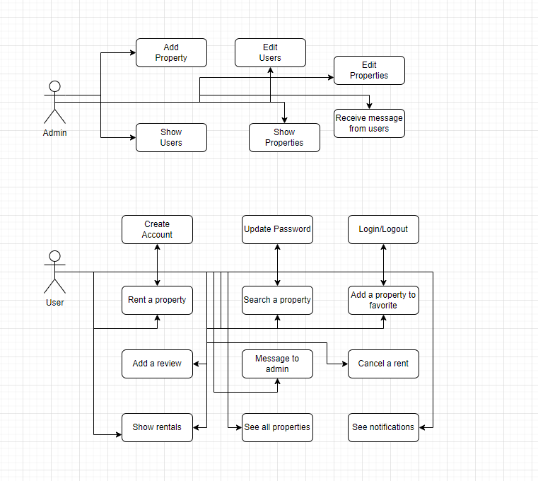
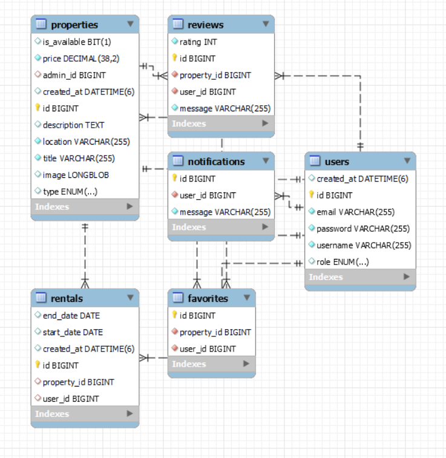

# Rent a House or Apartment

This website provides users with the opportunity to rent or purchase a house or an apartment. Each user can create a unique account, which allows them to access and utilize all the functionalities offered by the site.

## Features

### For Users

- **Login/Create an Account:** Users can log in to their account or create a new one.
- **Update Password:** Users can update their password.
- **Viewing Properties:** Users can view all properties.
- **Favorite Listings:** Users can save their favorite properties for easy access later.
- **Renting:** Users have the option to rent an apartment or a house for a specified period.
- **Add Reviews:** Users can add reviews to properties they have rented.
- **Notifications:** Users receive notifications if a property they favorited gets rented.
- **Messaging Admin:** Users can send messages to the admin regarding various issues with the platform.
- **Search Properties:** Users can search for properties by title.
- **Cancel Rentals:** Users can cancel rentals that have not yet started.

### For Admins

- **Single Admin:** There is currently only one admin.
- **Edit Properties and Users:** Admin can edit all properties and users, including viewing all user details.
- **Add Listings:** Only the admin can add new houses or apartments to the list of available rentals.
- **Get Reports:** Admin can obtain reports on apartments and houses that are currently rented.
- **View All Users:** Admin can see all registered users along with their details.
- **Receive Messages:** Admin receives messages from users regarding platform issues.

## Tech Stack

- **Backend:** Spring Boot
- **Database:** MySQL
- **Frontend:** React

Spring Boot is utilized for creating the backend services, providing an efficient and powerful way to build the application's API. MySQL is used as the database solution, offering reliable data storage and retrieval for both user and property information. React is used for building the frontend, providing a dynamic and responsive user interface.

## API Endpoints

The website offers a comprehensive set of API endpoints to manage users, properties, and rentals, supporting various operations such as insertion, deletion, updating, and retrieval of information. These endpoints ensure seamless interaction between the frontend and the backend services.

### User Endpoints

- **POST /user/insert**: Allows for the creation of a new user account.
- **DELETE /user/delete**: Enables the deletion of an existing user (admin only).
- **PUT /user/update**: Updates information for an existing user (admin only).
- **POST /user/findUser**: Retrieves information for a specific user (admin only).
- **GET /user/findAll**: Lists all registered users (admin only).
- **PUT /user/updatePassword**: Updates a user's password.
- **POST /user/login**: Authenticates a user's login credentials.

### Property Endpoints

- **POST /property/insert**: Adds a new property (house or apartment) to the available listings (admin only).
- **DELETE /property/delete**: Removes an existing property from the listings (admin only).
- **GET /property/findAll**: Retrieves a list of all properties.
- **POST /property/findByTitle**: Finds a property based on its title.
- **GET /property/findAvailables**: Lists all properties that are currently available for rent.
- **PUT /property/update**: Updates the details of an existing property (admin only).
- **PUT /property/updatePhoto**: Updates the photo of an existing property (admin only).
- **GET /property/findByTitlePriceAndLocation**: Searches for properties based on title, price, and location.
- **POST /property/search**: Searches for properties based on partial matches in title.

### Rental Endpoints

- **POST /rental/insert**: Registers a new rental agreement.
- **GET /rental/findAll**: Lists all rental agreements (admin only).
- **DELETE /rental/deleteAll**: Removes all rental agreements from the system (admin only).
- **POST /rental/getDays**: Retrieves unavailable rental days for a specific property.
- **POST /rental/getRentals**: Retrieves rentals for a specific user.
- **DELETE /rental/delete**: Deletes a specific rental agreement (admin only).
- **DELETE /rental/cancel**: Allows users to cancel their rentals that haven't started yet.

### Favorite Endpoints

- **POST /favorite/insert**: Adds a property to the user's favorite list.
- **DELETE /favorite/delete**: Removes a property from the user's favorite list.
- **POST /favorite/getFavorite**: Retrieves the list of favorite properties for a user.

### Notification Endpoints

- **POST /notification/insert**: Inserts a new notification for a user.
- **POST /notification/getNotifications**: Retrieves notifications for a specific user.

### Review Endpoints

- **POST /reviews/insert**: Inserts a new review for a property.
- **DELETE /reviews/delete**: Deletes an existing review (admin only).
- **POST /reviews/getReviews**: Retrieves reviews for a specific property.

---

These endpoints facilitate the robust functioning of the website, enabling users to rent or purchase homes, save favorites, receive notifications, and communicate with the admin. Admins can manage listings, users, rentals, and gather reports efficiently. The utilization of Spring Boot for backend services, MySQL for the database, and React for the frontend ensures a secure, reliable, and scalable application architecture.

## Testing

We have implemented and tested the functionalities using Mockito to simulate interaction with objects and methods in the application. The tests were designed to verify the correctness of insertion, update, deletion, and search operations, as well as to ensure the proper functioning of data display and notifications logic.
